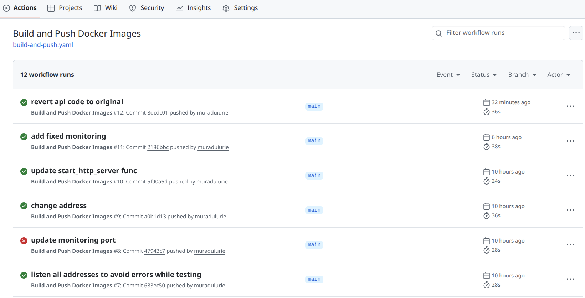
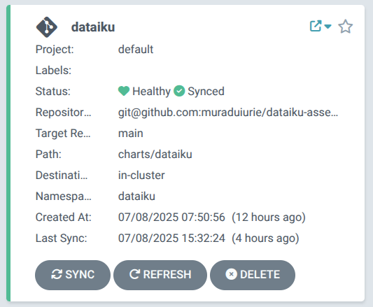
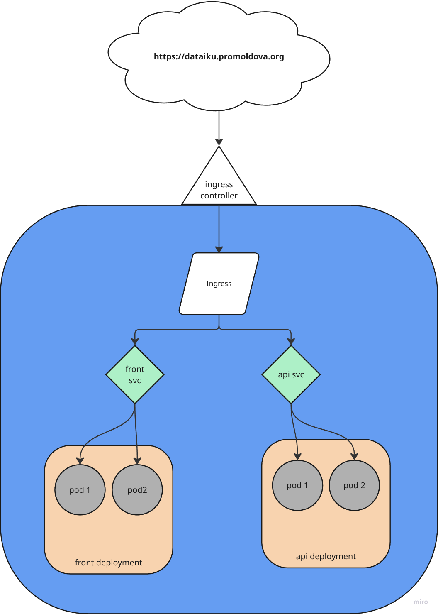
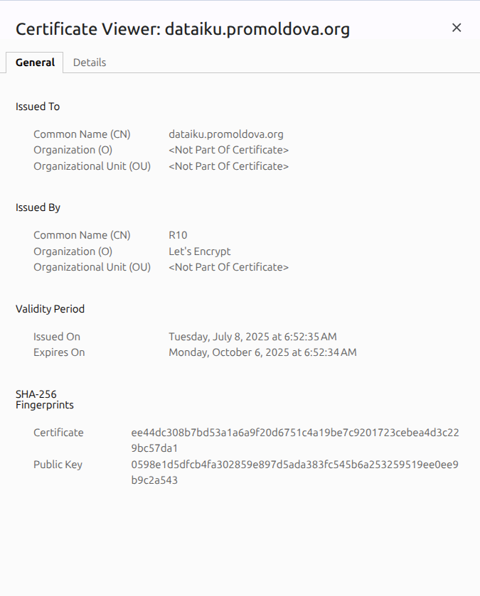
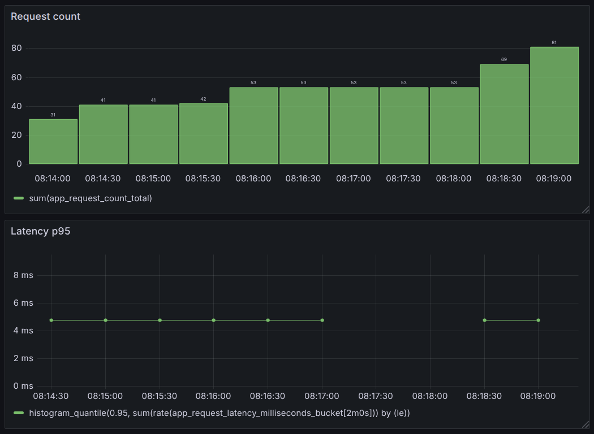

# DATAIKU ASSESSMENT

## Overview
Dataiku assessment application is composed of two main components:
- **Frontend**: A React application that provides a user interface for the assessment.
- **Backend**: A Flask application that serves the frontend and provides an API for determining the current time.

The application code can be found inside the `app` folder which contains two subfolders:
- `frontend`: Contains the React application code.
- `api`: Contains the Flask application code.

## Build
Each component has a dedicated Dockerfile for building the application images. The images are built using github actions once a change is made to the codebase.


The GitHub actions pipeline can be found in the `.github/workflows/build-and-push.yaml` file. The pipeline is triggered on every push to the `main` branch and builds the Docker images for both components.
## Deploy
The application contains a Helm charts which is used to deploy the application. The Helm chart is being automatically deployed and updated by the ArgoCD pipeline.



The Helm chart can be found in the `charts/dataiku` folder. The chart contains the following resources:
- **Frontend Deployment**: Deploys the pods for both frontend components.
- **Api Deployment**: Deploys the pods for both API components.
- **Front Service**: Exposes the Fronend application pods to the network.
- **Api Service**: Exposes the API pods to the network.
- **Ingress**: Configures the ingress controller to route the traffic to the application.
- **ServiceMonitor**: Configures Prometheus to monitor the application and collect metrics.

## Application architecture
The application contains two pods per component (Api and Frontend) for high availability. The pods are deployed in a Kubernetes cluster, which is managed by ArgoCD. The application is exposed via a service and an ingress controller.

### Diagram


In order to be able to fully utilize the application, the following components are necessary in the Kubernetes cluster:
- **Ingress Controller**: Manages the ingress resources and routes the traffic to the appropriate service.
- **Cert-Manager**: Manages the TLS certificates for the application and automatically renews them.
- **Prometheus**: Monitors the application and collects metrics from the serviceMonitor resource.
- **Grafana**: Visualizes the metrics collected by Prometheus and provides a dashboard for monitoring the application.
- **ArgoCD**: Manages the deployment of the application and ensures that the application is always in the desired state.

## DNS
The application can be accessed via the following DNS: [dataiku.promoldova.org](https://dataiku.promoldova.org). The DNS is managed by the Kubernetes ingress controller, which routes the traffic to the appropriate service based on the hostname. The domain registrar is **IONOS**.
```
dataiku.promoldova.org. IN CNAME ingress.promoldova.org.
ingress.promoldova.org. IN A 157.245.20.223
```

## TLS
The application is secured with TLS using a certificate issued by Let's Encrypt. The certificate is automatically provisioned and renewed by cert-manager using a `ClusterIssuer` resource. The `ClusterIssuer` is configured to request certificates from Let's Encrypt for the application's domain, and cert-manager ensures the certificate is kept up to date and valid across the cluster.

## Monitoring
The application has a dedicated serviceMonitor resource that is used to monitor the application. The serviceMonitor is configured to scrape the metrics from the application and send them to Prometheus for monitoring.

The serviceMonitor definition can be found in the helm chart templates folder: `charts/dataiku/templates/service-monitor.yaml`. The serviceMonitor is configured to scrape the metrics from the application every 30 seconds and send them to Prometheus.
